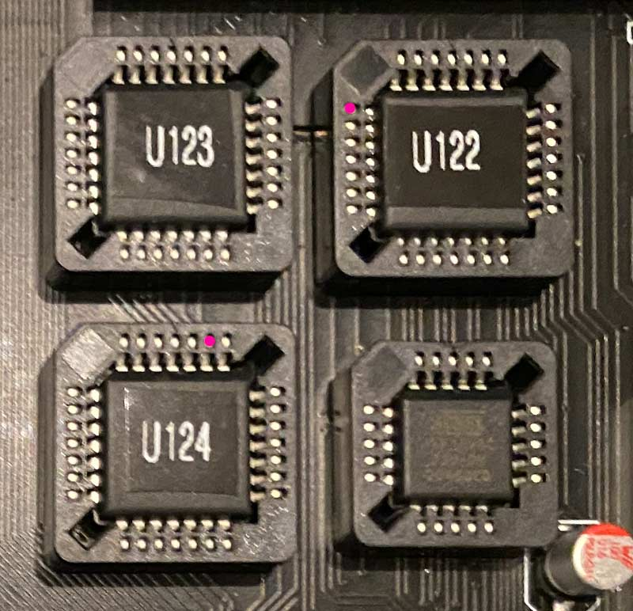

# Amiga and DSP 3210

This repo is about the Amiga and the DSP 3210. So what's what:

### dsp3210dist: 

A package for getting the DSP 3210 on the AA3000+ going. Contains drivers, docs, GAL logic and example code to get you started. (A driver extension for ATL DSP Zorro boards is also included, albeit entirely untested and possibly incomplete.) 

For **comprehensive info** on the DSP itself, also see "Doc" folder here. 

### GALs: 

The PLD and JEDEC files for U122, U123, U124 and U701 for the AA3000+. 

The PLD files contain the logic required to operate the DSP3210 and are updated versions of the originals found in the Haynie Archives. Several bugs were identified and fixed.

The JEDECs in this directory were created using WinCUPL 5.30.4.

If you are using a TL866II to program the ATFs, the 22v10s need to be burned in "UES" mode.

Timing/speed rating:

Numerous tests showed that GAL speed and type are essential. The test group settled entirely for ATFs because they are available as new parts.

Unfortunately, there is no known "one fits all" combination of speed ratings. The most promising/recommended combination is **ATF22V10C-5JX** for U122, U123, U124; and for U701: 
- either **ATF16V8C-7JU** with the **"U701_ATF16V8-R8"** logic (works with 68030 and several accelerators; notably *not CSMK3 and CSPPC)*, 
- or **ATF16V8BQL-15JU** (or any other ATF-15ns type) with the **"U701_ATF16V8-R9"** logic (works with 68030, A3640 and several accelerators; notably *not CSMK2 and WarpEngine*).

Be aware that these timing recommendations are only valid for ATFs, not GALs. ATFs and GALs are not fully compatible timingwise.

In order to test your set of ATFs on your machine, run the dsp3210devtest program provided in this archive. If this shows 0 errors after at least 5000 passes, your machine is very likely good to go. Note: If dsp3210devtest fails during the int6 test, but the int2 test is passed, your U124 is not up to date. Read and write errors are more likely due to timing issues with U122, U123 and/or U701. If your machine is running on the 68030, try the other alternative for U701 first (7+R8 vs 15+R9).

[Here](https://docs.google.com/spreadsheets/d/1c7zMVO1gBBRQ6kRbHjpwxwJw0_Bv94AN07wenYpk3eQ/edit?usp=sharing) is a list of combinations of ATFs tested with results.

Please note: Hese's AA3000+ boards (at least those he assembled before 2021, but I don't know if he ever corrected this) turned out to have one DSP related routing bug. The signals "**RW**" and "**R_W**", despite their different name, are in fact one and the same, while Hese treated them as two separate signals. In fact, they need to be connected for the DSP to work. The easiest way for already assembled boards is to run a wire from U122 pin 5 to U124 pin 27:

The pink spots mark the pins to be connected to each other. This is accomplished easily by making a wire noose around the ATF's pin and soldering it to this pin at the very top of the package, so it's above the socket spring when the chip is in its socket.

### Developing for the DSP3210:

AT&T's native development tools ("d32 tools", ie assembler, compiler, etc) are **not** included here. You might find them anywhere on the internet. They came in DOS and Amiga native versions, the latter a bit less far developed. Beware that using the DOS tools might give you little-endian DSP executables, see the documentation of dsp3210.library in the **dsp3210dist** package.

There is some effort in the Amiga community to write their own assembler/compiler, but I am not involved in this at all. Note that the dsp3210.library provided here only works with DSP executables created by the original d32 tools.

